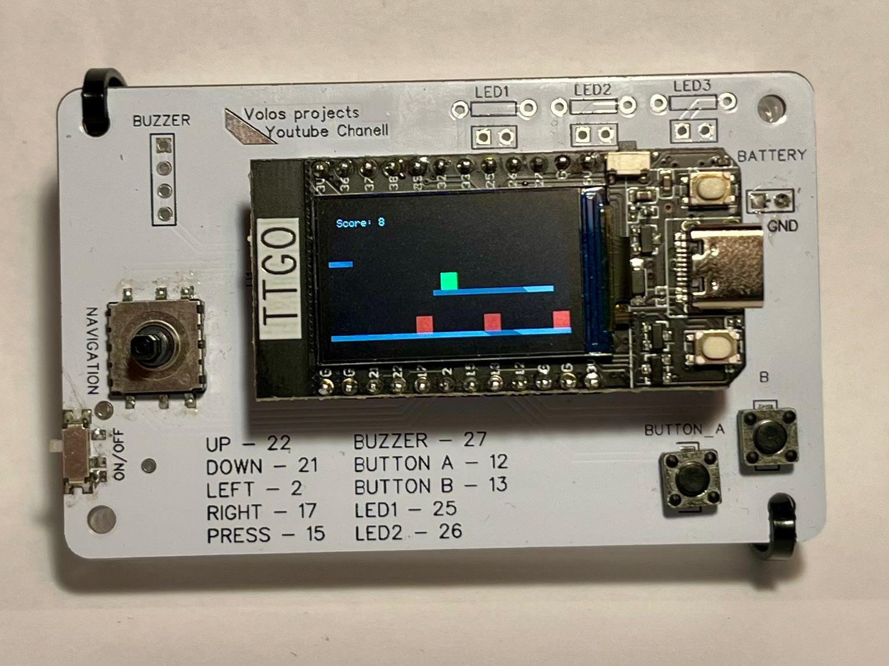

# PCB Jump and Run Game
A physics-based jump-and-run game running on a PCB with joystick and button controls, featuring obstacles, scoring, and a polished game flow.

---

## 🎥 Demo
[![Demo Video]<!-- (https://img.youtube.com/vi/dQw4w9WgXcQ/0.jpg) -->](https://www.youtube.com/watch?v=dQw4w9WgXcQ)
<!--  -->

---

## ✨ Key Features
- **Smooth Game Start**  
  Press Button A to start from the Start Screen into gameplay.  
  

- **Physics-based Jumping**  
  Character jump implemented with gravity simulation and jump velocity.  
  

- **Obstacle Avoidance**  
  Moving obstacles reset positions and increment score when passed.  
  

- **Score System & Game States**  
  Score increments as you run forward, with clear Start and Game Over screens.
  
 <!-- <video src="assets/gameover.mp4" controls autoplay loop muted></video> -->

- **PCB Hardware Controls**  
  Controlled via joystick (movement) and two buttons for jumping and starting.  
  

---

## 🧠 Project Context
This project was created during a special week at GIB focused on PCB programming.  
I decided to build a small but fun game combining:
- **C++ and Arduino framework**  
- **Real joystick & button input**  
- **OLED screen graphics (TFT_eSPI library)**  

The focus was on **smooth player control** and **game flow**.  
The game runs on a single PCB with display and is not meant to be easily reproducible.

---

## 🏗 How It Works (Technical Overview)
- **Game States**:  
  `0 = Start screen`, `1 = Playing`, `2 = Game Over`.  
  Button A transitions between states.
  
- **Jumping Physics**:  
  The player has vertical velocity, influenced by gravity each frame:
  ```cpp
  playerVelY += gravity;
  playerY += playerVelY;
  ```

- **Obstacles**:  
  Three obstacles move left and reset when off-screen:
  ```cpp
  obstacleX[i] -= obstacleSpeed;
  if (obstacleX[i] < -10) resetObstacle(i);
  ```

- **Collision Detection**:  
  Simple bounding-box collision checks between player and obstacles.
  
- **Drawing**:  
  Background, player, and obstacles are redrawn every frame for smooth animation.

---

## 👨‍💻 Author
Created by **Loris Stahlberg**  
<!-- Portfolio: [your-portfolio-link](https://your-portfolio-link.com) -->
